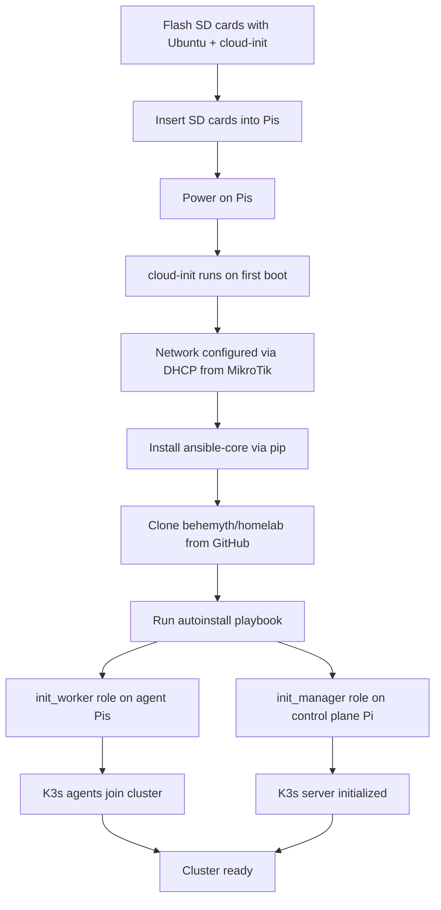

# Architecture

## Overview

A portable homelab cluster built from 4 Raspberry Pi 5s, managed by a MikroTik router and exposed to the internet through a Pangolin reverse tunnel on an Azure VPS.

## Network Topology

```mermaid
graph TB
    internet((Internet))

    subgraph Azure
        pangolin[Azure VPS<br/>Pangolin]
    end

    subgraph Home Network
        home_router[Home Router<br/>Dynamic IP]

        subgraph Cluster LAN – 10.42.0.0/24
            mikrotik[MikroTik Router<br/>DHCP · L2 Bridge · Tunnel Endpoint<br/>10.42.0.1]
            pi1[mini-wumpus<br/>Raspberry Pi 5<br/>10.42.0.10]
            pi2[mini-mush<br/>Raspberry Pi 5<br/>10.42.0.11]
            pi3[mini-mouse<br/>Raspberry Pi 5<br/>10.42.0.12]
            pi4[mini-sota<br/>Raspberry Pi 5<br/>10.42.0.13]
        end
    end

    internet <-->|Public IP| pangolin
    pangolin <-.->|Reverse Tunnel| mikrotik
    home_router --- mikrotik
    mikrotik --- pi1
    mikrotik --- pi2
    mikrotik --- pi3
    mikrotik --- pi4
```

| Device | Hostname | IP | Role |
|--------|----------|----|------|
| MikroTik Router | — | 10.42.0.1 | DHCP server, L2 bridge, tunnel endpoint |
| Raspberry Pi 5 | mini-wumpus | 10.42.0.10 | K3s node |
| Raspberry Pi 5 | mini-mush | 10.42.0.11 | K3s node |
| Raspberry Pi 5 | mini-mouse | 10.42.0.12 | K3s node |
| Raspberry Pi 5 | mini-sota | 10.42.0.13 | K3s node |
| Azure VPS | — | Public | Pangolin reverse tunnel ingress |

### Key points

- **Dynamic IP** — The home connection has no static IP. Pangolin on the Azure VPS provides a stable public endpoint via a reverse tunnel that terminates on the MikroTik.
- **DHCP** — The MikroTik assigns IPs to all Pis on the `10.42.0.0/24` subnet.
- **L2 bridge** — The MikroTik bridges all Pi-facing ports at layer 2. Routing/NAT between the cluster and the home network is TBD.

## Boot & Provisioning Flow



### Current state

- The `init_manager` role updates APT and configures DHCP (via `synodic.core.dhcp`). DHCP responsibility is moving to the MikroTik, so this role will be reworked.
- The `init_worker` role is a stub.
- SD card flashing is manual — automation is a goal but the method is TBD.

## Software Stack

```mermaid
graph TB
    subgraph Azure VPS
        pangolin_svc[Pangolin<br/>Reverse Tunnel Server]
    end

    subgraph MikroTik
        tunnel_client[Tunnel Client]
        dhcp[DHCP Server]
    end

    subgraph K3s Cluster – 4x Raspberry Pi 5
        direction TB

        subgraph Control Plane – 1 Pi
            k3s_server[K3s Server]
        end

        subgraph Agents – 3 Pis
            k3s_agent1[K3s Agent]
            k3s_agent2[K3s Agent]
            k3s_agent3[K3s Agent]
        end

        k3s_server --- k3s_agent1
        k3s_server --- k3s_agent2
        k3s_server --- k3s_agent3

        subgraph Workloads – TBD
            workload[Services deployed via K3s]
        end
    end

    pangolin_svc <-.-> tunnel_client
    tunnel_client --> k3s_server
```

### Decisions

| Topic | Status |
|-------|--------|
| K3s topology (dedicated control plane vs. dual-role) | TBD |
| Which Pi is the control plane | TBD |
| Cluster workloads | TBD |
| SD card flashing automation | TBD |
| Network boot (PXE) as alternative to SD | Open to exploring |

## Ansible Structure

This cluster is managed by the `behemyth.homelab` Ansible collection.

| Playbook | Target | Purpose |
|----------|--------|---------|
| `setup.yml` | localhost | Developer workstation setup (Vagrant, WSL) |
| `install.yml` | managers, workers | Full cluster initialization |
| `autoinstall.yml` | localhost, workers | First-boot provisioning via cloud-init |

| Role | Applied to | Purpose |
|------|-----------|---------|
| `init_manager` | Manager Pi | APT update, DHCP setup (being reworked) |
| `init_worker` | Worker Pis | TBD (stub) |
