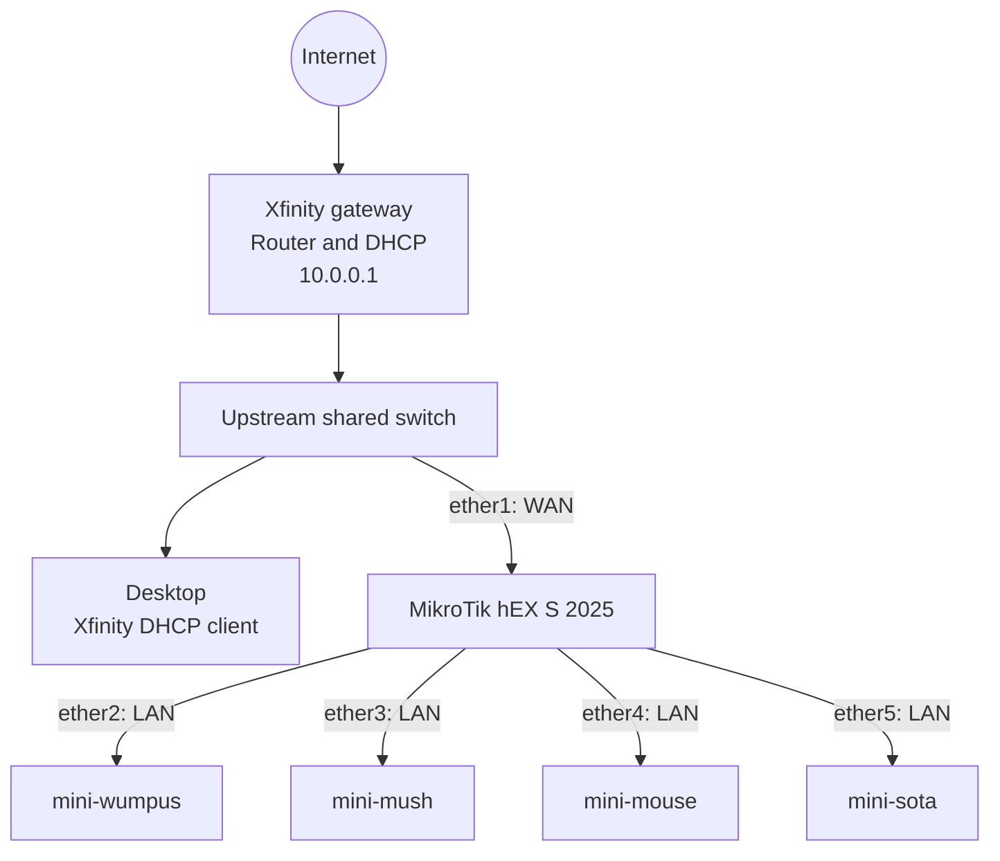
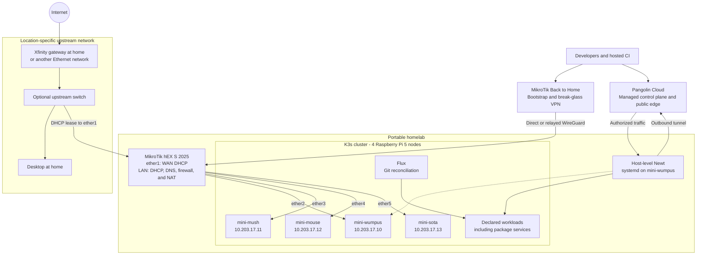
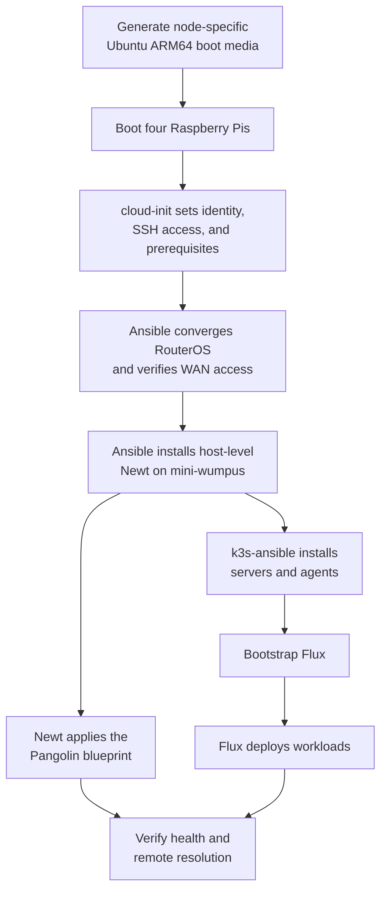
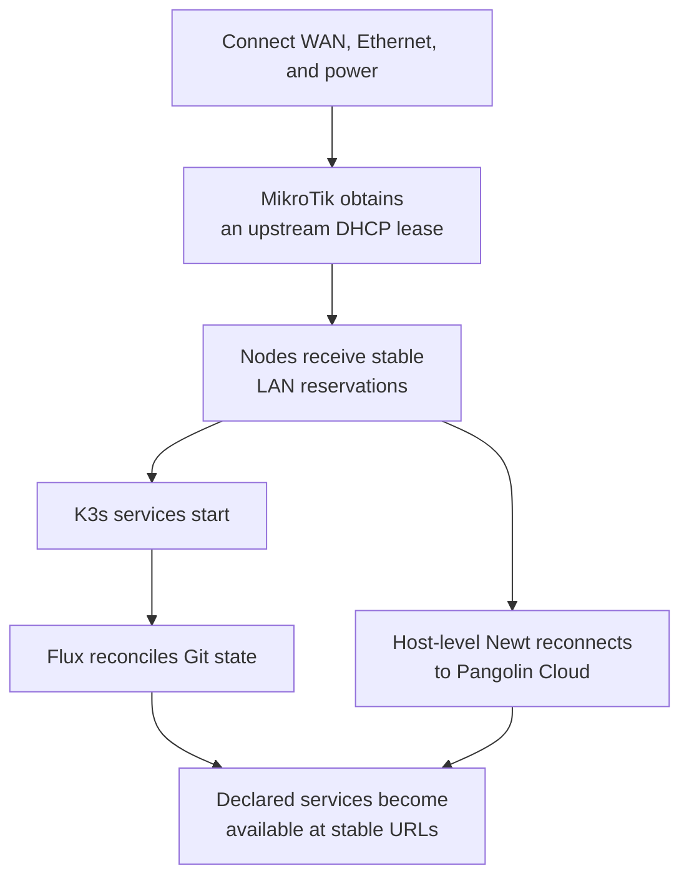

# Architecture

## Purpose

This repository is intended to make a four-node Raspberry Pi homelab portable
and reproducible. After initial commissioning, moving the lab should require
only an upstream internet connection, Ethernet, and power. The cluster should
recover its declared workloads without port forwarding, a static public IP, or
manual reconfiguration for each location.

The diagrams on this page distinguish the physical network observed today from
the target architecture. Components described as target state are not
necessarily implemented in the repository yet.

## Experience target

Initial commissioning should become one guided workflow that:

1. prepares Ubuntu Server ARM64 boot media for each Raspberry Pi;
2. configures and validates the MikroTik router;
3. installs a pinned Newt systemd service on `mini-wumpus` and verifies its
  outbound connection to Pangolin Cloud;
4. installs K3s with the maintained `k3s-io/k3s-ansible` collection; and
5. bootstraps Flux to reconcile cluster workloads from Git.

After commissioning, the normal relocation workflow is:

1. connect an Ethernet-based upstream network to MikroTik `ether1`;
2. connect the four Raspberry Pis directly to MikroTik `ether2` through
  `ether5`;
3. power the router and Raspberry Pis; and
4. wait for K3s, Flux, Newt, and the declared workloads to become healthy.

The upstream network must provide ordinary DHCP access. Captive portals,
Wi-Fi-only networks, PPPoE credentials, and provider-specific VLANs require an
additional upstream adapter or profile.

## Network topology

### Current physical topology

The network was observed with the desktop and MikroTik WAN connected as peers
on the same upstream switch. Each Raspberry Pi is connected directly to a
MikroTik LAN port:

The desktop does not traverse the MikroTik, but the four Pis are physically
downstream of it. The default RouterOS firewall normally prevents the desktop
from managing the router through `ether1`, so first-time administration needs a
temporary LAN-side connection.

The upstream switch must connect only to MikroTik `ether1`. Connecting that same
unmanaged switch to any Pi-facing LAN port would join the WAN and LAN broadcast
domains and place the Xfinity and MikroTik DHCP servers on the same network.

### Target portable topology

The MikroTik becomes the boundary between an untrusted, location-specific
upstream network and a stable homelab LAN. The four Pis remain directly attached
to its four copper LAN ports. At home, the shared switch remains upstream and
continues to serve the desktop independently.

The Xfinity gateway remains in normal router mode. Double NAT is acceptable:
Newt establishes outbound connections, attempts NAT traversal, and can fall
back to Pangolin Cloud relays. The Xfinity gateway therefore needs no DMZ,
port-forwarding rule, UPnP mapping, static lease, or bridge mode.

### Address plan

| Network or device | Target address | Assignment |
| --- | --- | --- |
| Upstream gateway | Location-specific | Outside repository control |
| MikroTik WAN | Upstream DHCP | Changes by location |
| Homelab LAN | `10.203.17.0/24` | Stable portable network |
| MikroTik LAN | `10.203.17.1` | Static gateway, DNS, and DHCP |
| `mini-wumpus` | `10.203.17.10` | DHCP reservation |
| `mini-mush` | `10.203.17.11` | DHCP reservation |
| `mini-mouse` | `10.203.17.12` | DHCP reservation |
| `mini-sota` | `10.203.17.13` | DHCP reservation |
| Maintenance and temporary clients | `10.203.17.100-199` | Dynamic DHCP pool |

The physical LAN must not use the previous `10.42.0.0/24` range. K3s uses
`10.42.0.0/16` for pods and `10.43.0.0/16` for services by default, so the old
LAN overlaps the cluster network.

The `10.203.17.0/24` range is the target baseline. The bootstrap workflow must
fail before making changes if the upstream network overlaps this range.

## Connectivity contract

The network design follows these rules:

- RouterOS owns LAN addressing, DHCP reservations, DNS forwarding, firewalling,
  and outbound NAT.
- The upstream gateway is treated as an unmanaged DHCP provider. Its credentials
  and configuration are not stored in this repository.
- The home switch is upstream of the MikroTik and connects only to `ether1`.
- The four Pis connect directly to `ether2` through `ether5`.
- Initial LAN-side maintenance requires temporarily replacing one Pi connection
  or adding a separate downstream switch. MikroTik documents the SFP cage as an
  alternate Internet port; it can become a maintenance LAN port only after its
  current RouterOS bridge and interface-list membership is inspected and changed.
- Cluster nodes use DHCP reservations rather than static network configuration
  in their operating-system images.
- No cluster service accepts unsolicited traffic from the upstream network.
- Routine remote access enters through private resources explicitly declared in
  Pangolin. MikroTik Back to Home provides bootstrap and break-glass access
  through a distinct WireGuard profile for each administrator device.
- WAN-side WebFig, WinBox, SSH, API, and API-SSL remain disabled.
- Newt runs as a pinned ARM64 systemd service on `mini-wumpus`, outside K3s, so
  management access does not depend on cluster reconciliation.
- RouterOS container mode remains disabled. The official Newt image publishes
  ARMv7 and ARM64 variants, while the hEX S (2025) EN7562CT accepts only ARMv5
  images. A custom image is not part of the production recovery path.

## Provisioning lifecycle

### One-time commissioning

Cloud-init prepares each operating system but does not orchestrate the cluster.
Ansible owns host and K3s bootstrap. Flux owns persistent Kubernetes state after
bootstrap. This avoids using `ansible-pull` independently on nodes for work that
requires cluster-wide ordering.

### Normal boot after a move

No Ansible command should be required during a normal move. A diagnostic command
may report progress and failures, but recovery is driven by system services and
Git reconciliation.

## Software ownership

| Layer | Owner | Responsibility |
| --- | --- | --- |
| Upstream internet | Xfinity or location operator | Internet access and upstream DHCP |
| Portable LAN | RouterOS managed by Ansible | Routing, DHCP, DNS, NAT, and firewall |
| Node first boot | Ubuntu Server and cloud-init | Identity, SSH access, and host prerequisites |
| Kubernetes installation | `k3s-io/k3s-ansible` | K3s installation, joining, and upgrades |
| Kubernetes desired state | Flux | Namespaces, Helm releases, manifests, and policies |
| External access | Pangolin Cloud and host-level Newt | Managed public edge and cluster-independent site tunnel |
| Bootstrap access | MikroTik Back to Home | Relayed or direct WireGuard access to RouterOS and the LAN |
| Console recovery | Future optional hardware | Not required by the baseline; needed for unbootable hosts |
| Application data | Workload-specific storage and backup | Persistence, retention, and recovery |

Ansible remains the bootstrap and machine-management tool. It should not become
a second Kubernetes reconciliation system after Flux is installed.

## Storage and K3s topology

The final K3s server topology depends on node storage:

- With SSD or NVMe storage on at least three nodes, use three K3s servers with
  embedded etcd and one agent.
- With SD-card storage, start with one server and three agents. K3s warns that
  embedded etcd is write-intensive and unsuitable for SD cards.

Package data should initially use one explicitly selected, SSD-backed storage
node and verified off-cluster backups. Distributed storage such as Longhorn or
Ceph should be introduced only when its additional failure handling justifies
its operational cost.

## Security and secrets

- RouterOS management is allowed only from the homelab LAN.
- Remote RouterOS management is carried inside Back to Home or an authorized
  Pangolin private resource, never through its upstream address.
- The upstream network is untrusted, even when it is the home Xfinity gateway.
- No Xfinity, RouterOS, Pangolin, K3s, or workload credential is stored in
  plaintext in Git.
- Pangolin resources deny access until explicitly declared and authorized.
- Publisher credentials for a package service are limited to protected CI
  environments; developer identities receive read access by default.
- Backups include application data, metadata, authorization configuration, and
  the material required to reconstruct cluster secrets.

## Implementation status

| Area | Repository today | Target |
| --- | --- | --- |
| Network documentation | Old multi-NIC manager and `10.42.0.0/24` LAN | MikroTik boundary with four directly attached nodes |
| Router automation | RouterOS configured outside Ansible | Idempotent `community.routeros` role and diagnostics |
| Node imaging | Obsolete Subiquity-oriented autoinstall file | Generated Ubuntu ARM64 cloud-init media |
| Manager role | APT update and obsolete DHCP role | Replaced by maintained K3s automation |
| Worker role | Debug stub | Replaced by maintained K3s automation |
| K3s | Documented but not installed by this repository | Pinned `k3s-io/k3s-ansible` collection |
| GitOps | Not present | Flux bootstrapped once and reconciled from Git |
| Pangolin | Cloud service selected; no deployment configuration | Pinned Newt systemd service and declarative blueprint |
| Package service | Product not selected | Product spike, deployment, monitoring, and recovery |

## Decisions and open questions

| Topic | Status |
| --- | --- |
| Router | MikroTik hEX S 2025, product code E60iUGS |
| Upstream contract | Ethernet DHCP; no inbound gateway configuration required |
| Physical order | Upstream switch -> MikroTik `ether1`; four Pis -> `ether2-5` |
| Homelab LAN | Target `10.203.17.0/24`; must not overlap upstream |
| External access | Managed Pangolin Cloud with host-level Newt on `mini-wumpus` |
| Remote management | Pangolin private resources for routine access; Back to Home for bootstrap |
| Console recovery | No baseline hardware dependency; residual risk is documented |
| Reconciliation | Ansible for bootstrap, Flux for Kubernetes workloads |
| K3s server count | Select after confirming SSD or SD-card storage |
| Persistent storage | Select the SSD-backed node and backup destination |
| Package service | Run the Conan-compatible product-selection spike |
