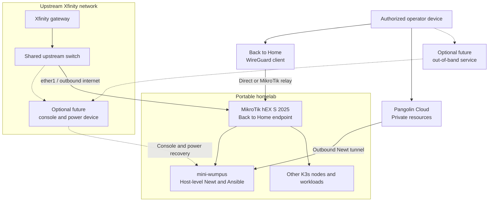

# Remote management

The homelab needs a management path that works while the operator is away and
does not expose RouterOS services on the upstream network. The production
baseline uses Back to Home and Pangolin. It does not depend on JetKVM or another
console device, so failures below the operating-system network stack remain an
explicit residual risk.

## Management paths

### Bootstrap and break-glass access

MikroTik Back to Home is the first remote path. The hEX S (2025) uses an ARM
processor and supports Back to Home on RouterOS 7.12 or newer. Back to Home
creates an end-to-end encrypted WireGuard tunnel. When the router is behind the
Xfinity gateway, it can use a MikroTik relay without a public IP address or an
Xfinity port-forwarding rule.

Back to Home is a bootstrap and break-glass mechanism, not the normal path for
application traffic. Each administrator device receives a distinct profile
that can be revoked independently. LAN access is enabled only for administrator
profiles. Profiles are secrets and never enter Git.

Once connected, an operator can reach the RouterOS LAN address and SSH to
`mini-wumpus` to run the repository's bootstrap workflow.

### Normal administrative access

Pangolin private resources provide routine access after `mini-wumpus` is
online. A pinned Newt systemd service runs on that host and is independent of
K3s reconciliation. The initial resources should expose only:

| Resource | Destination | Allowed ports | Audience |
| --- | --- | --- | --- |
| Bootstrap controller | `mini-wumpus` LAN address | TCP 22 | Named administrators and managed machines |
| Router automation | MikroTik LAN address | TCP 22 or 8729 | `mini-wumpus` only |
| Router administration | MikroTik LAN address | TCP 8291 | Named administrators only |

Use Pangolin private resources rather than public resources. Access is granted
to explicit users, roles, or machine identities. No identity receives resource
access by default.

### Why Newt does not run on the router

The hEX S (2025) can run RouterOS containers, but its EN7562CT processor accepts
only ARMv5 container images. The official Newt image publishes AMD64, ARMv7,
and ARM64 variants. It does not publish ARMv5.

Maintaining a custom ARMv5 image would make management depend on an unsupported
build, external USB storage, physically enabled RouterOS container mode, and a
third-party process inside the router being recovered. RouterOS also warns that
enabling containers increases the router's attack surface. Back to Home already
provides the required router-native outbound management tunnel, so container
mode remains disabled.

### Console recovery limitation

The baseline has no independent console or remote power hardware. Back to Home
depends on RouterOS reaching the internet. Pangolin depends on `mini-wumpus` and
RouterOS forwarding. Neither path can recover a router that does not boot or a
Pi that fails before networking and SSH start.

A future out-of-band design may add a console device and remote power control
on the upstream side. Until then, production readiness includes a UPS,
watchdogs, tested automatic service recovery, and acceptance that some hardware
failures require an on-site visit.

## RouterOS service policy

The MikroTik WAN address is location-specific and is not a management endpoint.
The upstream interface must not accept WebFig, WinBox, SSH, API, or API-SSL.

| Service | Target policy |
| --- | --- |
| Telnet and FTP | Disabled |
| HTTP WebFig | Disabled |
| HTTPS WebFig | Disabled unless a specific operational need is documented |
| SSH | Key-only; restricted to `mini-wumpus` and approved VPN sources |
| WinBox | Restricted to approved VPN sources |
| API | Disabled |
| API-SSL | Optional; valid certificate and bootstrap-controller source restriction |
| Neighbor discovery and MAC tools | LAN interfaces only |

An automation identity is separate from human administrator identities. Grant
only the RouterOS policies required by the selected Ansible modules. Store its
private key in the `mini-wumpus` secret store, not in the repository.

## One-time local commissioning

The router currently responds on its upstream address but exposes no management
service there. One LAN-side session is therefore unavoidable before remote
operation is possible.

1. Temporarily connect a trusted computer to `ether2` through `ether5`.
2. Sign in through WinBox or WebFig using the current LAN address.
3. Record the RouterOS version and export the configuration with sensitive
   values hidden.
4. Create an encrypted binary backup and store it off the router.
5. If necessary, update RouterOS to a supported stable release while local.
6. Enable IP Cloud DDNS and Back to Home.
7. Create a unique LAN-enabled profile for an administrator device.
8. Disconnect that device from the local network and prove the tunnel over
   cellular or another external connection.
9. Confirm that the router and at least one Pi are reachable through the tunnel.
10. Only then return the Pi cable and end the local session.

Do not reset RouterOS or replace its complete configuration during this first
session. The existing export must be reviewed before Ansible is allowed to
converge routing, DHCP, or firewall state.

## Remote bootstrap

After commissioning, an operator can bootstrap from another trusted device:

1. connect the device to Back to Home or the Pangolin private network;
2. SSH to `mini-wumpus`;
3. run the diagnostic command and require all network checks to pass;
4. run the idempotent bootstrap command;
5. monitor K3s, Flux, Newt, and workload readiness; and
6. retain the management session until the alternate access path is verified.

The eventual bootstrap command must be safe to rerun. It stops before modifying
RouterOS when the upstream and homelab subnets overlap, the backup cannot be
created, or no recovery path is healthy.

## Change safety

Router changes can disconnect every downstream node. Apply them under these
constraints:

- create a fresh export and binary backup before each change set;
- use RouterOS Safe Mode for interactive routing, bridge, and firewall changes;
- apply small changes and verify both Back to Home and Pangolin between stages;
- use Ansible check and diff modes where the module supports them;
- never perform an unattended RouterOS reset or firmware upgrade;
- retain at least one known-good WireGuard profile offline; and
- test restore and remote recovery on a schedule.

Back to Home depends on RouterOS and the MikroTik WAN path. Pangolin depends on
`mini-wumpus` and RouterOS forwarding. Because both paths remain in-band, the
bootstrap workflow must refuse high-risk unattended changes unless a tested
rollback is available.
