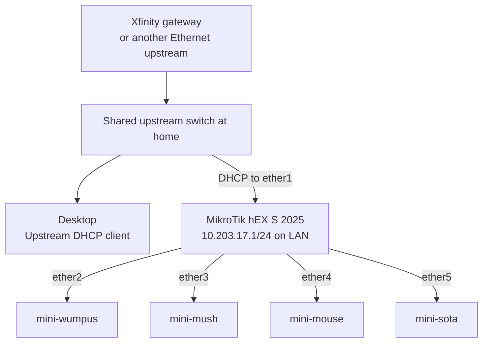

# Commissioning and relocation

This guide describes the intended operator experience for the portable homelab.
The automation commands named below define the target interface and are not all
implemented yet. See the [architecture and implementation status](architecture.md)
before using the current playbooks on physical hosts.

## Required topology

The MikroTik must sit between the location-specific upstream network and the
four Raspberry Pis. At home, the shared switch remains on the upstream side and
also connects the desktop:

The upstream switch must connect only to MikroTik `ether1`. Do not connect the
same unmanaged switch to `ether2` through `ether5`. That would join the WAN and
LAN broadcast domains and place two DHCP servers on the same network.

### Cable the network

1. At home, connect an Xfinity LAN port to the shared upstream switch.
2. Connect the desktop and MikroTik `ether1` to that switch.
3. Connect `mini-wumpus` to MikroTik `ether2`.
4. Connect `mini-mush` to MikroTik `ether3`.
5. Connect `mini-mouse` to MikroTik `ether4`.
6. Connect `mini-sota` to MikroTik `ether5`.
7. Power the upstream equipment and MikroTik before powering the nodes.

At another location, MikroTik `ether1` may connect directly to the Ethernet
upstream when no upstream switch is needed. The four Pi connections do not
change.

At home, the Xfinity gateway remains in normal router mode. Do not configure a
DMZ, port forward, UPnP mapping, static lease, or bridge mode for Pangolin.
Newt initiates its connections outbound and can use Pangolin Cloud relays when
direct NAT traversal is unavailable.

Back to Home also works while the MikroTik is behind the Xfinity gateway. It
uses direct NAT traversal when possible and an end-to-end encrypted MikroTik
relay otherwise, so it does not require an inbound Xfinity rule.

## First RouterOS access

Before the router automation exists, use this one-time access procedure:

1. Temporarily disconnect one Pi from `ether2` through `ether5`.
2. Connect the maintenance computer to that LAN port and renew its DHCP lease.
   A dedicated LAN-side switch may be used instead. Do not assume the SFP cage
   is on the LAN: the hEX S (2025) manual identifies it as an alternate Internet
   port, so it must be inspected and deliberately configured before LAN use.
3. Confirm that the computer receives a `192.168.88.x` address from the default
   RouterOS configuration.
4. Open `http://192.168.88.1` or connect with WinBox.
5. Sign in with the factory credentials printed on the router label.
6. Store the replacement administrator password in the chosen secret store,
   never in this repository.
7. When commissioning is complete, reconnect the Pi and return the desktop to
   the upstream switch.

Before ending this local session, enable and externally test the Back to Home
bootstrap path described in [remote management](remote-management.md). Do not
start unattended RouterOS automation until a configuration export, encrypted
backup, and tested remote profile all exist.

Do not reset a configured router merely because `192.168.88.1` is unavailable.
First verify that the maintenance computer is connected to a Pi-facing LAN port,
not to the upstream switch or MikroTik `ether1`.

## Target address plan

RouterOS will provide the stable addresses used by automation:

| Device | Address |
| --- | --- |
| MikroTik LAN | `10.203.17.1` |
| `mini-wumpus` | `10.203.17.10` |
| `mini-mush` | `10.203.17.11` |
| `mini-mouse` | `10.203.17.12` |
| `mini-sota` | `10.203.17.13` |
| Temporary clients | `10.203.17.100-199` |

The nodes use DHCP reservations. Their operating-system images should not
contain static location-specific network configuration.

The previous `10.42.0.0/24` physical LAN is not reusable because it overlaps
K3s's default `10.42.0.0/16` pod network. Bootstrap must also stop if the
upstream DHCP lease overlaps `10.203.17.0/24`.

## Prepare the nodes

The target image workflow creates one Ubuntu Server ARM64 image per node. Each
image contains only the node-specific first-boot data needed to establish a
management connection:

- a unique hostname;
- the administrator's SSH public key;
- DHCP networking;
- required K3s host prerequisites; and
- unique SSH host keys generated on first boot.

Private SSH keys, RouterOS credentials, Pangolin credentials, and cluster join
tokens must not be embedded in an image or committed to Git.

The current `config/autoinstall.yml` models the retired multi-NIC manager and
Subiquity installer flow. It is not the source for the target Raspberry Pi
images.

## Planned command interface

The completed repository should expose the following small operator interface:

| Command | Responsibility |
| --- | --- |
| `pdm run image` | Guide creation and validation of the four boot devices |
| `pdm run doctor` | Check cabling, RouterOS, WAN DHCP, nodes, secrets, and Pangolin reachability |
| `pdm run bootstrap` | Converge RouterOS, install K3s, and bootstrap Flux |
| `pdm run status` | Summarize node, K3s, Flux, Newt, and workload health |
| `pdm run backup` | Trigger and verify an off-cluster backup |

These commands are a design contract, not a claim about the current
`pyproject.toml`. Until they are implemented, do not substitute the existing
`install.yml` or `autoinstall.yml` playbooks without reviewing their
implementation status.

After the one-time local commissioning, connect through Back to Home and SSH to
`mini-wumpus` to invoke these commands while away. Pangolin private resources
become the routine management path after host-level Newt is running there.

## Normal relocation

Once commissioning is complete, moving the homelab should require no
configuration-management command:

1. connect the new upstream Ethernet network directly or through an upstream
   switch to MikroTik `ether1`;
2. connect the four Pis to MikroTik `ether2` through `ether5`;
3. power the network equipment and nodes;
4. wait for the nodes to receive their reservations and start K3s;
5. let Flux reconcile the declared workloads; and
6. verify the Newt site and service health in Pangolin Cloud.

Changing public IP addresses and upstream private subnets do not change service
URLs. RouterOS obtains a new WAN lease, and Newt reconnects outbound to Pangolin
Cloud.

## Troubleshooting signals

| Symptom | Likely cause |
| --- | --- |
| Desktop receives `10.0.0.x` at home | Expected while it remains on the upstream switch |
| `192.168.88.1` is unreachable from the desktop | The desktop is upstream of the RouterOS WAN firewall; use a temporary LAN connection |
| Competing gateways or unstable DHCP | The upstream switch is also connected to a Pi-facing MikroTik LAN port |
| MikroTik has no default route | `ether1` did not receive an upstream DHCP lease |
| Newt is offline but internet works | Check DNS, `app.pangolin.net`, Cloud PoPs, and the Newt secret |
| Bootstrap reports an overlapping WAN subnet | Use a non-overlapping LAN profile before installing K3s |

The diagnostic command should report these conditions without making
destructive changes.
